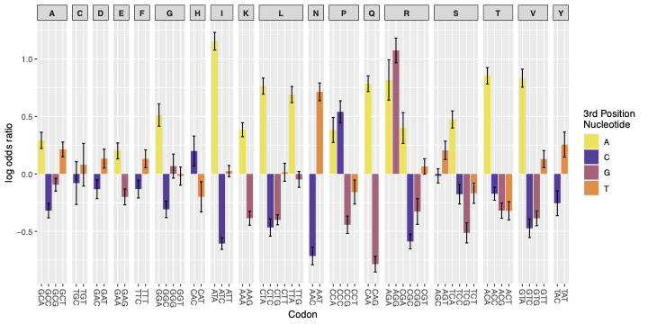

# Figure 2B – Trans.FCC log odds analysis (Goodman et al., 2013)

This folder contains the necessary data, scripts and output files to recreate Figure 2B, which assesses if the AGG paradox remains when using the translation efficiency metric that is normalised to the mean value of the 13 codon variants, for that transgene. To do this log odds ratios were calculated for each codon being enriched in the 5'end of mRNA constructs associated with the highest Trans.FCC values compared to those with the lowest, relative to its synonyms. This uses data from Goodman et al (2013)

---
##  Contents

- `1241934tables1.csv`  
  > Input dataset from Goodman et al. (2013), containing Prot.FCC, Trans.FCC and Trans expression metrics.

- `TransFCC_Log_odds.py`  
  > Python script used to calculate the log odds ratios and standard errors from the Goodman Trans.FCC dataset.

- `log_odds_results_Trans.FCC.csv`  
  > Output from the above script containing log odds and standard errors for each codon

- `Fig2B.R`  
  > R script that uses the above CSV file to generate the ggplot bar plot 

- `figure_2B.pdf`  
  > Final output showing codon log odds ratios with bars coded by the 3rd nucleotide and standard error bars

---

## Plot



AGG appears as an outlier codon positively associated with high expression — supporting the paradox observed in Prot.FCC analysis.

---

## To regenerate the figure

1. To compute log odds (if you want to recreate 'log_odds_results_Trans.FCC.csv'), run the python script:
   ```bash
   python TransFCC_Log_odds.py

2. To generate the plot, run the R script: 
    ```r
    source("Fig2B.R")
    ```
