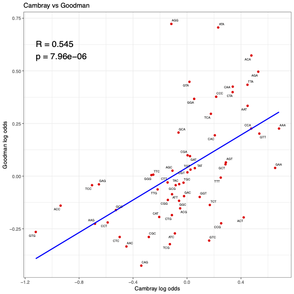

# Figure 3B – Correlation between Goodman and Cambray log odds

This folder contains the necessary data, scripts, and output files to recreate Figure 3B, this assesses whether the codon enrichment log odds observed in Cambray et al (2018) are predictive of those from Goodman et al (2013).

---

## Contents

- `log_odds_results_Transs.csv`  
  > Log odds ratios and standard errors from Goodman et al. (2013), calculated using the Trans metric.

- `log_odds_results_Cambray.csv`  
  > Log odds ratios and standard errors from Cambray et al. (2018), calculated using translation efficiency values.

- `XY_Correlation_Cambray_Goodman.r`  
  > R script that generates the correlation plot.

- `Figure_3B.pdf/png`  
  > Output plot showing the correlation between Goodman and Cambray log odds values.

---

## Plot



The pearson correlation coefficient appears lower than what is expected, considering they are both measuring translation efficiency. The AGG codon is one of the least predicted codons with regards to the Cambray et al (2018) data set.


---

## To regenerate the figure

Run the R script:

```r
source("XY_Correlation_Cambray_Goodman.r")
