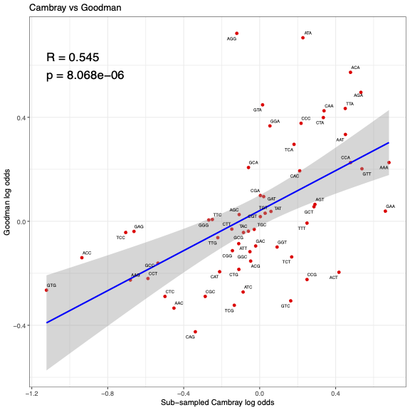

# Figure 3C – Correlation between subsampled Cambray and Goodman log odds

This folder contains the necessary data, scripts, and output files to recreate Figure 3C, which assesses whether correcting for equal sample sizes changes the correlation coefficient between the Goodman et al (2013) and Cambray et al (2018) data set.

To do this, the Cambray data set (244,000 transgenes) was randomly sub-sampled 1000 times to calculate the log odds of ~14,000 constructs (similar sample size to the Goodman data set). Each sub-sample log odds was then averaged and this was then compared to the Goodman trans log odds data set using Pearson correlation.

---

## Contents

- `Cambray.csv`  
  - Input data with RNA and protein counts for 244,000 transgenes (includes `clean.lin.prot.mean` and `ss.rna.dna.mean` columns)
  - As this file is too large, `Cambray.csv` is available via https://static-content.springer.com/esm/art%3A10.1038%2Fnbt.4238/MediaObjects/41587_2018_BFnbt4238_MOESM58_ESM.zip
  - Please rename this file to 'Cambray.csv' for the scripts to work

- `Cambray_Subsampled_logodds.csv`  
  - Mean log odds for each codon after sub-sampling the Cambray dataset.

- `log_odds_results_Transs.csv`  
  - Log odds ratios regarding the trans metric from Goodman et al. (2013).

- `XY_Correlation_Sub_sampled_Cambray_Goodman.r`  
  - R script that generates the correlation scatter plot.

- `Sub_sample_Cambray.py`  
  - Python script used to perform 1,000 random subsamples of the Cambray data and calculate codon log odds ratios for each. The averaged log odds ratios were put into `Cambray_Subsampled_logodds.csv`.

- `Figure_3C.pdf`  
  - Final plot showing correlation between subsampled Cambray log odds and Goodman log odds.

---

## Plot 



The correlation coefficient between the log odds from the sub-sampled Cambray data set and the Goodman data set are unchanged compared to when using the pre-subsampled Cambray data set. This indicates the differences in sampling size is not contributing to the observed AGG paradox in Goodman et al (2013)

---

## To regenerate the figure

1. To calculate subsampled Cambray log odds averages, run in python:

   ```bash
   python Sub_sample_Cambray.py

2. To generate the plot:

    ```r
    source("XY_Correlation_Sub_sampled_Cambray_Goodman.r")
    ```
