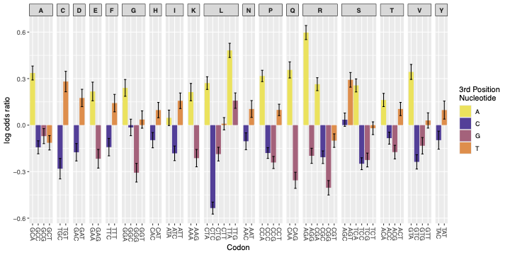

# Figure 4A – TEF log odds analysis (Osterman., 2020)

This folder contains the necessary data, scripts and output files to recreate Figure 4A . This shows the log odds ratios for each codon being enriched in the 5'end of mRNA constructs associated with the highest translation efficiency fractions (TEFs) compared to those with the lowest, relative to its synonyms. This uses data from Osterman et al (2020)

---
##  Contents

- `Supplementary table 1.csv`  
  > Input dataset from Osterman et al (2020), containing transgenes and their corresponding TEF value.
  > This can be sourced from https://oup.silverchair-cdn.com/oup/backfile/Content_public/Journal/nar/48/12/10.1093_nar_gkaa430/1/gkaa430_supplemental_files.zip?Expires=1749721159&Signature=rUwhDf9LcyJHJ8ltMhydCtGr4jFWUp~dP3vmDwqMOsoePMQlgCazJ-F~~pc-0M0LTFwHjOEjUdBI9VFlYpCeQF0NM787zHefEbC-VUdNQjRzmaZ2VfSHvk7f5wpjprdxpA3pMQSO1Iusxf~~ahslrk-oYxUrN10nr0GxI1awzj6BVEb0pCYVnLzBsOrOxhpNT0KB9IVxYFiEkIlQ3zAIz5~Rcyop-d42PLtP3~jaHvqp42Y07PqiJARRISsYryDztI3eaQfHqCfikx9n84jdRpMSwIA8NvZaZiEVZsLQabhj0kci6AqO2n3cnSxW9ERGZZamMh4m29iAdnvAmq799w__&Key-Pair-Id=APKAIE5G5CRDK6RD3PGA

- `Osterman_Log_odds_LB.py`  
  > Python script used to calculate the log odds ratios from the Osterman TEF dataset.

- `Osterman_log_odds.csv`  
  > Output from the above script containing log odds and standard errors for each codon

- `Fig_4A.R`  
  > R script that uses the above CSV file to generate the ggplot bar plot 

- `figure_4A.pdf/png`  
  > Final output showing codon log odds ratios 

---

## Plot



Similarly to the data from Cambray et al (2018), here, AGG appears negatively associated with high protein levels.

---

## To regenerate the figure

1. To compute log odds (if you want to recreate 'Osterman_log_odds.csv' ), run the python script:
   ```bash
   python Osterman_Log_odds_LB.py

2. to generate the plot, run the R script: 
    ```r
    source("Fig_4A")
    ```
