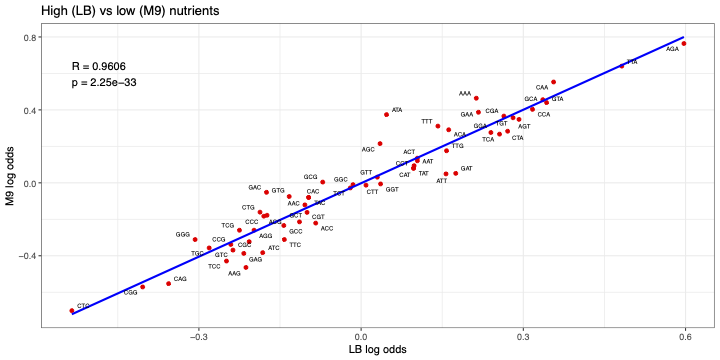

# Figure 4B – Correlation between LB and M9 conditions in Osterman et al. (2020)

This folder contains the necessary data, scripts, and output files to recreate Figure 4B. This compares codon log odds values derived from E. coli cultured in nutrient rich (LB) vs nutrient poor (M9) media, using the dataset published by Osterman et al (2020).

This gives insight into whether differences in nutrient availabiltiy influences codon usage patterns and if this could account for the unsual AGG codon behaviour in the Goodman et al (2013) data set.

---

## Contents

- `Osterman_log_odds.csv`  
  - Log odds ratios from transgene experiments in LB media.

- `Osterman_log_odds_M9.csv`  
  - Log odds ratios from transgene experiments in M9 media

- `XY_Correlation_Osterman_LBvsM9.r`  
  - R script that generates the correlation plot.

- `Osterman_Log_odds_M9.py`  
  - Python script used to generate the M9-based log odds ratios using TEF quartiles.

- `Figure_4B_LB_vs_M9_Osterman.pdf`  
  - Final figure showing the correlation between LB and M9 log odds values.

---

## Plot

The log odds data sets from both experiments are highly correlated, indicating that nutrient availability has minimal influence on the codon usage patterns affecting translation efficiency and is unlikely to contribute to the unusual behavior seen with the AGG codon in Goodman et al (2013).



---

## To generate the figure

1. To compute the M9 log odds, run the python script:

    ```bash
    python Osterman_Log_odds_M9.py
    ```

2. To generate the plot, run the R script:

    ```r
    source("XY_Correlation_Osterman_LBvsM9.r")
    ```
