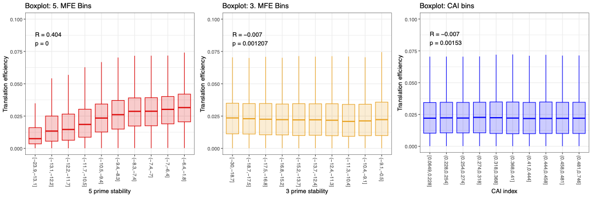

# Figure 5A-C – Correlations between translation efficiency and sequence features.

This folder contains the necessary data, scripts and output files to recreate Figure 5A-C. This investigates how well translation efficiency is predicted by the 5' stability, 3' stability and codon adaptation index of mRNA constructs from Cambray et al (2018).

Constructs were binned equally on the x feature and then box plots were used to show the correlation trend against translation efficiency.

---
##  Contents

- Cambray.csv 
  - Input data with RNA and protein counts for 244,000 transgenes (includes 'clean.lin.prot.mean' and 'ss.rna.dna.mean' columns)
  > As this file is too large, Cambray.csv is available via https://static-content.springer.com/esm/art%3A10.1038%2Fnbt.4238/MediaObjects/41587_2018_BFnbt4238_MOESM58_ESM.zip
  > Please rename this file to 'Cambray.csv' for the scripts to work   

- 'Cambray_trans+properties.csv'
  > Note this file was too large to upload - generate using 'Trans_predictions.py'
  
- 'Trans_predictions.py' 
  > Python script used to extract the correct columns from 'Cambray.csv' and put them into 'Cambray_trans+properties.csv'

- 'Trans_predictions.R'  
  > R script that uses the 'Cambray_trans+properties.csv' file to generate the ggplot box plots

- 'Figure_5'
  > Final output showing box plots for correlation between translation efficiency and each feature.

---

## Plot



5’ secondary structure stability was the strongest predictor. In contrast, the stability of 3’ secondary structures and the codon adaptation index showed virtually no correlation. 

---

## To regenerate the figure

1. To extract the columns and produce 'Cambray_trans+properties.csv':
   ```bash
   python Trans_predictions.py

2. To generate the plot, run the R script: 
    ```r
    source("Trans_predictions.R")
    ```

